# HeidiSQL

## インストールの手順

### ダウンロード

下記サイトからHeidiSQLをダウンロードする  
https://forest.watch.impress.co.jp/library/software/heidisql/

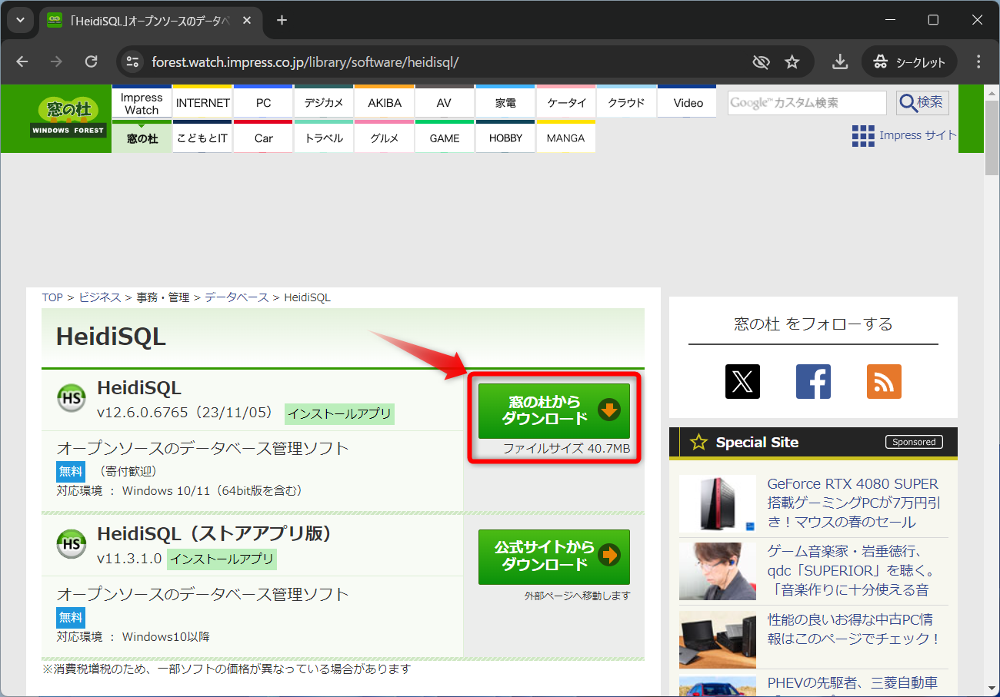

「ダウンロード」フォルダに保存する  
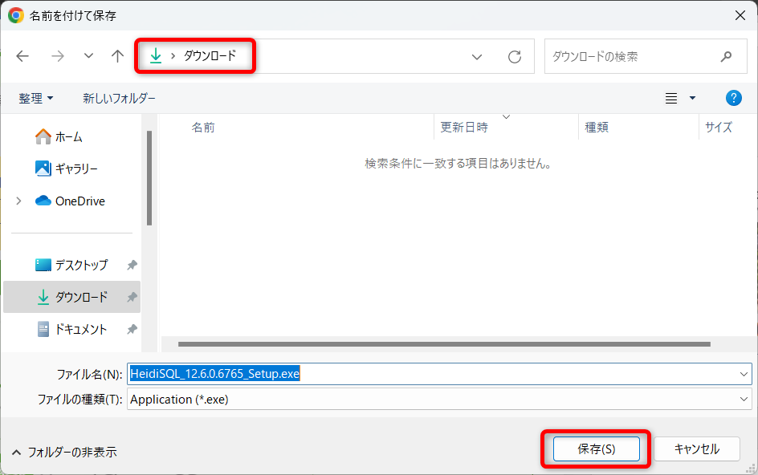

### インストール

ダウンロードしたファイルを実行  
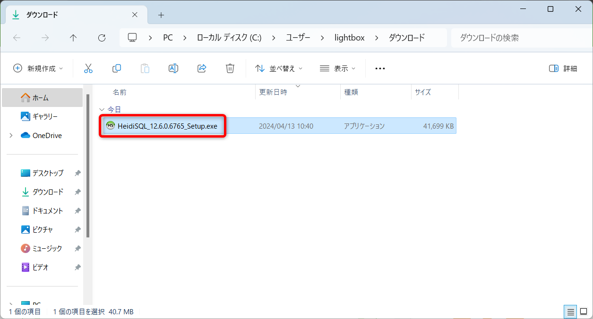

「現在のユーザー用にインストール」をクリック  
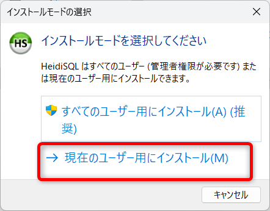

「同意する」にチェックを入れて「次へ」をクリック  
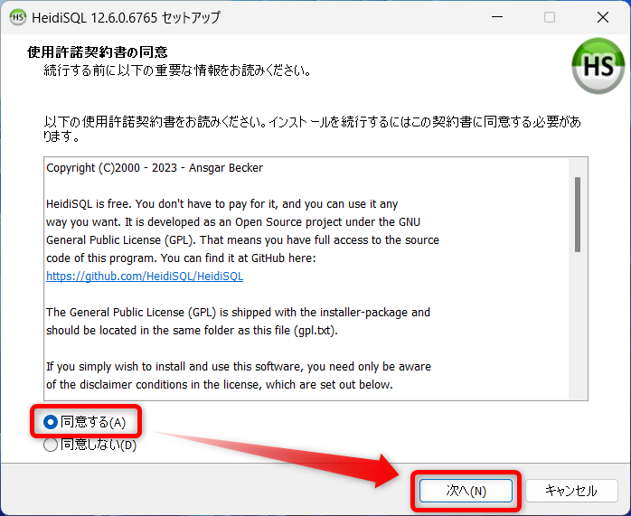

「次へ」をクリック  
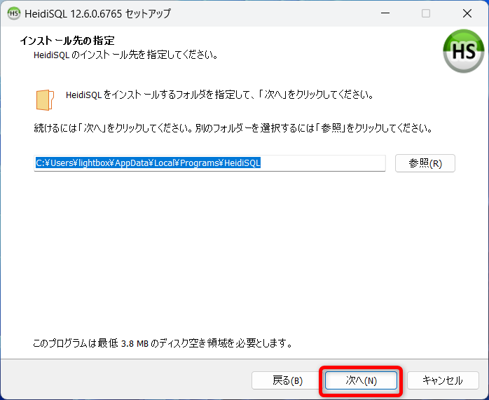

「次へ」をクリック  
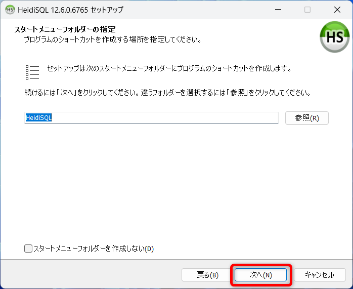

「次へ」をクリック  
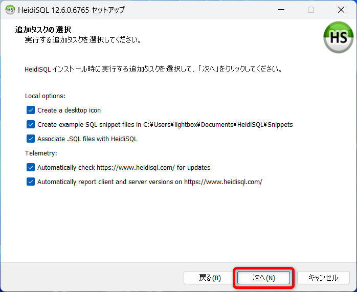

「インストール」をクリック  
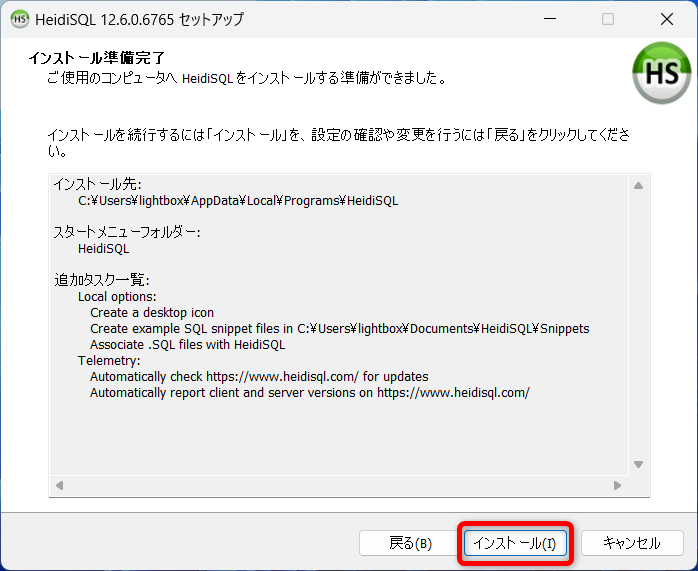

「完了」をクリック  
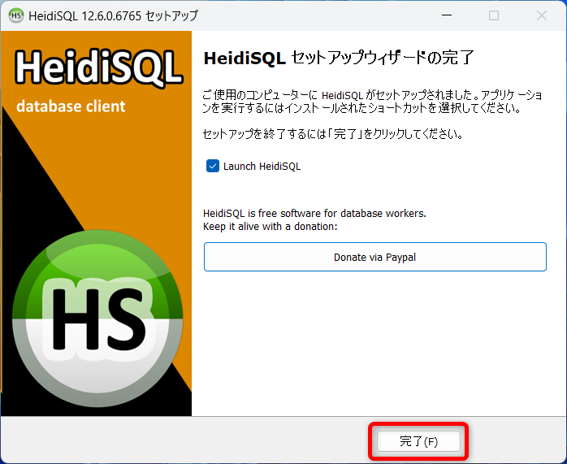

HeidiSQLが起動すればインストール完了  
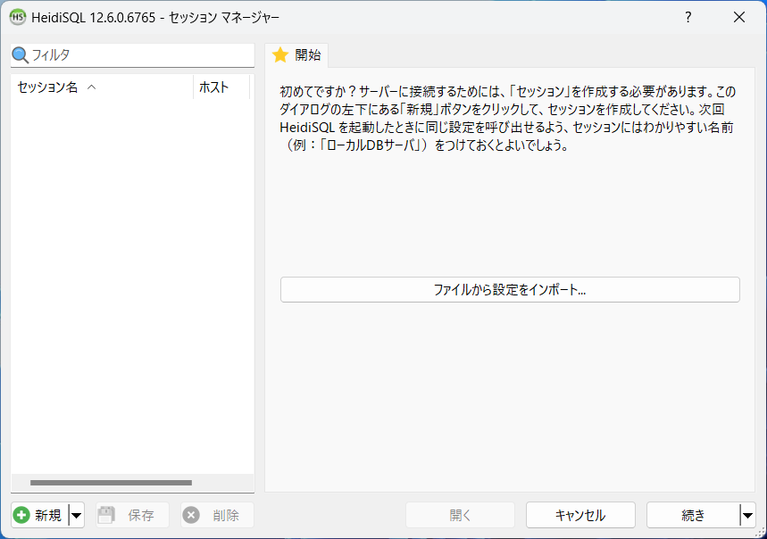
